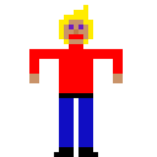
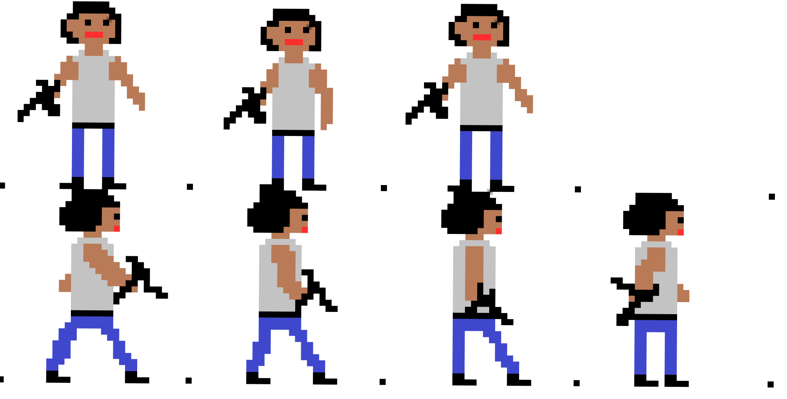

### Projektidee

Wir haben lange überlegt, welches Spiel wir selbst mit SDL2 umsetzen wollen.
Einige Ansätze zur Orientierung waren unter anderem:
- <p align=justify>bbtan : Ein Blockbreaker Spiel, bei dem man eine wachsende Anzahl von Bällen in eine Richtung schießt, um Geld für den Kauf neuer Bälle sowie Power-Ups einzusammeln. Die Bälle verringern den Wert des Blockes den Sie berühren und prallen in eine andere Richtung ab. Da die Bälle an der unteren Seite des Spielfelds entweichen können, ist eine Runde vorbei, wenn kein Ball mehr auf dem Spielfeld ist. Danach Rücken alle Blöcke eine Reihe nach unten und es spawnen oben neue Elemente. Rücken die Elemente nach ganz unten, ist das Spiel vorbei. Je mehr Reihen von Blöcken überlebt wurden, desto höher fällt am Ende auch der Punktestand aus, denn dieser zählt die durchgestandenen Runden.</p>
- <p align=justify>Geometry Dash : Ein Autoscroller, bei dem die einzige Nutzereingabe das Betätigen des Sprungbuttons ist, um Hindernisse zu überwinden und das Ziel zu erreichen. Während des Spiels läuft ein Song, dessen Beat häufig mit den benötigten Sprungbefehlen übereinstimmt. Es gibt Spitze Dreiecke die eine Runde direkt beenden, Doppelsprungpads und weitere Elemente, die jedes Level einzigartig machen.</p>
<p align=justify>
Schlussendlich haben wir uns aber dazu entschieden, uns an Boxhead zu orientieren.
Das ursprüngliche Spiel Boxhead ist nicht mehr verfügbar, da es den nicht mehr unterstützten Flash-Player benötigte.
Ziel des Spiels ist es, eine möglichst hohe Punktzahl zu erreichen, wozu man Wellenweise spawnende Gegner und Bosse besiegen muss. Dazu stehen dem Spieler unterschiedlichste Waffen zur Auswahl: platzierbare Bomben, Raketenwerfer, Shotguns, Gewehre und einige andere. Gegner droppen manchmal einen Würfel, durch den Waffen freigeschaltet, oder Leben und Munition aufgefüllt wird. Besiegt man in kurzer Zeit mehrere Gegner hintereinander, erhöht sich ein Kombozähler, wodurch mehr Punkte generiert werden.
</p>

### 25.04.2021

<p align=justify>Als allererstes war es natürlich nötig SDL2 in unseren IDEs einzurichten. Hierfür haben wir die nötigen Properties und Abhänigkeiten eingestellt. Als Hello World haben wir ein farbiges Fenster anzeigen lassen.</p>

### 29.04.2021
<p align=justify>Um nun die ersten Schritte zu machen haben wir erstmal die Game.cpp formuliert. Diese dient dazu ein Fenster für das Spiel zu erstellen und einen Renderer zuzuweisen. Dieser Renderer wird später dafür sorgen, dass Objekte und Bilder angezeigt werden. Des Weiteren besitzt die Game- Klasse die Methoden update() und render(), welche im Gameloop immer wieder aufgerufen werden. Diesen Gameloop haben wir in der Main.cpp implementiert. Die Main.cpp erstellt zu beginn ein Game und ruft die Initialiserungs- Funktion auf. Diese legt fest wie groß und an welcher Position das Fenster des Spiels ist und welchen Titel es hat. Der Gameloop läuft so lange wie das Spiel läuft. Im Gameloop werden alle eingehenden Events verarbeitet, das Game geupdated und zum Schluss mit der Renderfunktion angezeigt. Wenn der Gameloop beendet wird, wird nurnoch die Cleanfunktion aufgerufen, welche das Fenster und den Renderer "zerstört".
</p>
<p align=justify>Nachdem wir den Gameloop am laufen hatten, welcher nur ein Fenster angezeigt hat, haben wir ein ersten Entwurf unseres Characters gemacht. Hierfür haben wir das Programm Piskel verwendet, welches sich als sehr einfach in der Handhabung bewiesen hat, jedoch genau das erfüllt was wir brauchten. Nämlich ein mit wenig Pixeln dargestelltes "Männchen".
</p>


<p align=justify>Die .png Datei des Characters haben wir nun in unseren assets Ordner hinzugefügt und haben unsere erste Textur in das Fenster geladen.
```cpp
SDL_Surface* tmpSurface = IMG_Load("assets/Player.png");
playerTex = SDL_CreateTextureFromSurface(renderer, tmpSurface);
SDL_FreeSurface(tmpSurface);
```
Damit SDL unsere Bilder anzeigen kann mussten wir zuerst noch die SDL_Image Bibliothek ins Projekt einbinden. Danach haben wir die Textur mithilfe des update- Funktion für jeden Durchlauf des Gameloops um einen Pixel nach rechts verschoben. Außerdem haben wir damit sich unser Männchen gleichmäßig bewegt ein Frame- Limit eingebaut. Dieses sorgt dafür, dass jeder Durchlauf des Gameloops mindestens 16,6 Millisekunden dauert (60 Frames per Second).
</p>

### 11.05.2021
<p align=justify>Für das einfachere Hinzufügen von Objekten in das Spiel haben wir zuerst einen Texturemanager erstellt, welcher eine Textur aus einem Bild erstellt. In der LoadTexture- Funktion macht das selbe wie der oben verwendete Code zum Laden einer Textur. Im nächsten Schritt wurde noch die GameObject.cpp hinzugefügt, welche eine Textur erhält und an den übergebenen Koordinaten platziert. Mithilfe der Update() und Render()- Funktion können in der Game.cpp nun einfach verschiedene GameObjects bewegt und angezeigt werden.
</p>

### 25.05.2021
<p align=justify>Um das Spielfeld darzustellen, werden wir eine TileMap implementieren, die dann verschiedene Texturen anzeigt. Bevor wir das tun, ändern wir aber noch unser Renderer-Object zu einem statischen, da es inzwischen an sehr vielen Stellen verwendet wird, und eine zentrale Anlaufstelle für diesen Fall sehr geeignet ist. In diversen Methoden wird nun "Game::renderer" verwendet, und an anderen Stellen muss der Renderer nun nicht mehr als Parameter übergeben werden. Aber jetzt zurück zur TileMap. Für Diese erstellen wir eine neue Klasse Map. Im dazugehörigen Konstruktor werden mithilfe des Texturmanagers die verschiedenen 32x32 großen Texturen geladen. Danach kann die klasseneigene Methode loadMap aufgerufen werden, um mithilfe eines zweidimensionalen Arrays zu bestimmen, an welcher Stelle später die jeweiligen Texturen der Map angezeigt werden sollen. Mit der Funktion loadMap werden dann die entsprechenden Texturen an ihren Positionen gerendered. Die neue Funktion "draw" des TextureManagers ermöglicht es, anzugeben, wo genau die Textur platziert werden muss. In Zukunft werden noch weitere und detailiertere Texturen für die Map folgen, aber für den Anfang werden simple Texturen genügen.
</p>

### 29.05.2021
<p align=justify>In unserem neuesten Update haben wir ein Entity-Component-System eingefügt. Dieses ermöglicht es uns, mehrere Entitäten einfach zu erstellen und ihnen verschiedene Eigenschaften zuzuteilen. Diese Eigenschaften können z.B. die Geschwindigkeit eines Gegners bestimmen, die Position ändern oder eine Waffe zuweisen und die Kampfattribute beeinflussen. Das System besteht aus dem Manager, der alle Entitäten durchlaufen und updaten kann. Außerdem gibt es Entitäten, die über verschiedene Eigenschaften verfügen und Komponenten, die verschiedenste Eigenschaften umsetzen. Aktuell ist unsere einzige Komponente die Position, welche sich mit jedem Update verändert, aber in Zukunft wird durch dieses System das Erstellen neuer Eigenschaften besser umsetzbar.
</p>

### 31.05.2021
<p align=justify>Heute wurden zuerst eigene Dateien für die SpriteComponents und die TransformComponents erstellt. Die SpriteComponents bieten die Möglichkeit Texturen zu laden und an gewünschte Positionen zu zeichnen. Mithilfe der TransformComponents können aktuell die Positionen der Entities verändert werden. Zur weiteren Vorbereitung zum Bewegen verschiedener Charaktere und dem feststellen von Kollisionen wurde die Vector2D Klasse hinzugefügt. In der Vector2D Klasse wurden nun einige Rechenoperatoren überschrieben um in Zukunft auf gewünschte Weise einfach mit diesen Vektoren rechnen zu können. An sich besteht ein Vektor aus einer x und einer y Variable, welche nun addiert, subtrahiert, multipliziert und dividiert werden können. In Zukunft werden diese Vektoren einen großen Vorteil bieten können bei der Bewegung von Projektilen und dem Feststellen von Kollisionen dieser Projektile mit Gegnern.
</p>

### 04.06.2021
<p align=justify>Damit sich unsere Spielfigur bewegen kann haben wir nun eine erste Steuerung eingebaut. Mit den Tasten w, a, s und d kann die Figur nun über das Fenster bewegt werden. Hierzu wurde die KeyboardController.h zu den Components hinzugefügt. In der KeyboardController- Klasse gibt es nun eine TransformComponent, welche beim drücken der festgelegten Tasten ihre velocity (Geschwindigkeit) ändern. Wenn man nun beispielsweise die w- Taste drückt wird der y- Wert des Velocity- Vektors der TransformComponent auf -1 gesetzt. Dadurch wird in der update- Funktion der TransformComponent vom y- Wert der Position immer etwas abgezogen. Dies sorgt dafür, dass sich das Männchen nach oben bewegt. Dies geschieht solange bis die Taste losgelassen wird, da in diesem Fall der y- Wert des Velocity- Vektors wieder auf 0 gesetzt wird. Allgemein wird das Drücken und Loslassen der Tasten über die Abfrage des Eventtypes festgestellt. Wird eine Taste gedrückt ist der Eventtyp = SDL_KEYDOWN und wird sie losgelassen ist er SDL_KEYUP. Wurde festgestellt was der Fall ist wird über ein switch- Statement festgestellt, welche Taste gedrückt wurde und je nachdem wird der Velocity- Vektor angepasst.
</p>

### 14.06.2021
<p align=justify>Damit unsere Entities mit anderen Entities oder der Map zusammenstoßen und am weiterbewegen gehindert werden, oder generell eine Kollision erkannt wird, fügen wir heute die ersten Teile der Erkennung hinzu. Für diesen Zweck legen wir zuerst eine neue Komponente an, die passenderweise ColliderComponent.h heißt. Diese Komponente gibt der Entity eine Hitbox, die später zur Berechnung verwendet wird. Diese Berechnung findet in der Klasse Collision statt. Aktuell ist nur die AABB Kollision, also für zwei Rechtecke, implementiert. In der Game.cpp haben wir dann erstmal testweise eine neue Wand eingefügt, der eben dieser ColliderComponent zugeteilt wird. Da der Spieler ebenfalls diese Komponente erhält, kann nun in der update- Funktion überprüft werden, ob eine Kollision stattfindet. Es wird zwar aktuell nur ein Text in der Konsole ausgegeben, aber später soll beispielsweise der Spieler daran gehinder werden, sich durch eine Wand zu bewegen.
</p>

### 15.06.2021
<p align=justify>Um die Kollisionen sinvoll einzubauen wird der Spieler nun wenn der Spieler die Wand berührt zurückgeworfen. Dies führt dazu, dass der Spieler sich nicht mehr durch die Wände bewegen kann. Außerdem wurden TileComponents hinzugefügt. Diese ermöglichen es einfach die Map mit den verschiedenen Objekten zu füllen (Boden, Wand, Lava). Dafür werden jeweils die x, y, Höhe, Breite und die jeweilige ID der TileComponent benötigt.
  
Des weiteren wurde das erstellen der Maps verändert. Der Aufbau der Map wird nun aus einer Datei geladen, welche eine 16x16 Map speichert. Diese ist mit 0en, 1en und 2en gefüllt und wird beim Erstellen eingelesen. Wenn beispielsweise eine 2 eingelesen wird, wird die jeweilige TileComponent als Lava erstellt. Am wichtigsten dafür war die Anpassung der loadMap() Funktion, welche den Pfad der Datei und die x und y- Werte der Map braucht (in diesem Fall 16x16). Danach wird die datei mit 2 For- Schleifen eingelesen. Ansonsten mussten kleine Änderungen in der Game.cpp vorgenommen werden und es konnten viele alte Codestückchen zum erstellen der Map entfernt werden.
</p>

### 17.06.2021
<p align=justify>Nachdem wir zuletzt unsere Map aus einer Datei geladen haben, wurde die Spielerfigur nicht mehr oberhalb der Map angezeigt. Um das Zukünftig besser zu Organisieren, erstellen wir Gruppen, denen die Entities zugehörig sein können. Das Gruppensystem ist ähnlich zu dem bereits vorhandenen Komponentensystem. Ein Manager verwaltet die jeweiligen Gruppen, und dieser kann den Entities übergeben werden. Eine Entity kann allerdings mehreren Gruppen angehören. Diese Gruppen werden 
dann nacheinander im Renderschritt abgearbeitet und die Entities werden im Fenster platziert. 
 </p> 
 
### 18.06.2021
<p align=justify>Im heutigen Update wurden erste Animationen eingebaut. Dafür musste zuerst ein neues png erstellt werden, in welchem alle Einzelbilder der verschiedenen Animationen abgebildet sind. Die einzelnen Frames einer Animationen sind von links nach rechts angeordnet und werden nach und nach durchlaufen. Für jede neue Animation muss im png 32 Pixel tiefer geschaut werden, da alle einzelnen Bilder aktuell 32x32 sind. Die Animationen werden ausgewählt je nachdem, welcher Index ihr zugewiesen wurde. Aktuell besitzt der Spieler eine kleine Animation wenn er steht und für das Laufen nach links und rechts. Diese Laufanimation wird aktuell auch noch abgespielt wenn der Charakter nach oben oder unten läuft. In der png Datei ist nur die Animation für das laufen von links nach rechts, jedoch kann diese durch  das SDL_RenderFlip- Flag einfach gespiegelt werden. Um die Animationen anzuzeigen wird im KeyboardController bei den jeweiligen Tasten die play- Funktion aus der SpriteComponent aufgerufen, welche die Animation abspielt. 
  
Somit haben wir nun die Möglichkeit in unsere png beliebig viele Animationen zu erstellen, denen wir nur eine ID, die Anzahl der frames und die Geschwindigkeit, wie schnell die Frames nacheinander angezeigt werden sollen, zuweisen müssen. Diese Animationen werden in einer Map abgespeichert und können über ihren Namen (Key) benutzt werden.  
</p>

