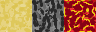
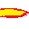
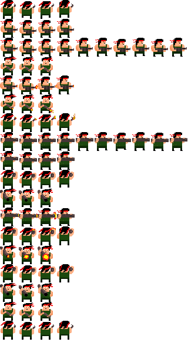

### Projektidee

Wir haben lange überlegt, welches Spiel wir selbst mit SDL2 umsetzen wollen.
Einige Ansätze zur Orientierung waren unter anderem:
- <p align=justify>bbtan : Ein Blockbreaker Spiel, bei dem man eine wachsende Anzahl von Bällen in eine Richtung schießt, um Geld für den Kauf neuer Bälle sowie Power-Ups einzusammeln. Die Bälle verringern den Wert des Blockes den Sie berühren und prallen in eine andere Richtung ab. Da die Bälle an der unteren Seite des Spielfelds entweichen können, ist eine Runde vorbei, wenn kein Ball mehr auf dem Spielfeld ist. Danach Rücken alle Blöcke eine Reihe nach unten und es spawnen oben neue Elemente. Rücken die Elemente nach ganz unten, ist das Spiel vorbei. Je mehr Reihen von Blöcken überlebt wurden, desto höher fällt am Ende auch der Punktestand aus, denn dieser zählt die durchgestandenen Runden.</p>
- <p align=justify>Geometry Dash : Ein Autoscroller, bei dem die einzige Nutzereingabe das Betätigen des Sprungbuttons ist, um Hindernisse zu überwinden und das Ziel zu erreichen. Während des Spiels läuft ein Song, dessen Beat häufig mit den benötigten Sprungbefehlen übereinstimmt. Es gibt Spitze Dreiecke die eine Runde direkt beenden, Doppelsprungpads und weitere Elemente, die jedes Level einzigartig machen.</p>
<p align=justify>
Schlussendlich haben wir uns aber dazu entschieden, uns an Boxhead zu orientieren.
Das ursprüngliche Spiel Boxhead ist nicht mehr verfügbar, da es den nicht mehr unterstützten Flash-Player benötigte.
Ziel des Spiels ist es, eine möglichst hohe Punktzahl zu erreichen, wozu man Wellenweise spawnende Gegner und Bosse besiegen muss. Dazu stehen dem Spieler unterschiedlichste Waffen zur Auswahl: platzierbare Bomben, Raketenwerfer, Shotguns, Gewehre und einige andere. Gegner droppen manchmal einen Würfel, durch den Waffen freigeschaltet, oder Leben und Munition aufgefüllt wird. Besiegt man in kurzer Zeit mehrere Gegner hintereinander, erhöht sich ein Kombozähler, wodurch mehr Punkte generiert werden.
</p>

### 25.04.2021

<p align=justify>Als allererstes war es natürlich nötig SDL2 in unseren IDEs einzurichten. Hierfür haben wir die nötigen Properties und Abhänigkeiten eingestellt. Als Hello World haben wir ein farbiges Fenster anzeigen lassen.</p>

### 29.04.2021
<p align=justify>Um nun die ersten Schritte zu machen haben wir erstmal die Game.cpp formuliert. Diese dient dazu ein Fenster für das Spiel zu erstellen und einen Renderer zuzuweisen. Dieser Renderer wird später dafür sorgen, dass Objekte und Bilder angezeigt werden. Des Weiteren besitzt die Game- Klasse die Methoden update() und render(), welche im Gameloop immer wieder aufgerufen werden. Diesen Gameloop haben wir in der Main.cpp implementiert. Die Main.cpp erstellt zu beginn ein Game und ruft die Initialiserungs- Funktion auf. Diese legt fest wie groß und an welcher Position das Fenster des Spiels ist und welchen Titel es hat. Der Gameloop läuft so lange wie das Spiel läuft. Im Gameloop werden alle eingehenden Events verarbeitet, das Game geupdated und zum Schluss mit der Renderfunktion angezeigt. Wenn der Gameloop beendet wird, wird nurnoch die Cleanfunktion aufgerufen, welche das Fenster und den Renderer "zerstört".
</p>
<p align=justify>Nachdem wir den Gameloop am laufen hatten, welcher nur ein Fenster angezeigt hat, haben wir ein ersten Entwurf unseres Characters gemacht. Hierfür haben wir das Programm Piskel verwendet, welches sich als sehr einfach in der Handhabung bewiesen hat, jedoch genau das erfüllt was wir brauchten. Nämlich ein mit wenig Pixeln dargestelltes "Männchen".
</p>


<p align=justify>Die .png Datei des Characters haben wir nun in unseren assets Ordner hinzugefügt und haben unsere erste Textur in das Fenster geladen.
```cpp
SDL_Surface* tmpSurface = IMG_Load("assets/Player.png");
playerTex = SDL_CreateTextureFromSurface(renderer, tmpSurface);
SDL_FreeSurface(tmpSurface);
```
Damit SDL unsere Bilder anzeigen kann mussten wir zuerst noch die SDL_Image Bibliothek ins Projekt einbinden. Danach haben wir die Textur mithilfe des update- Funktion für jeden Durchlauf des Gameloops um einen Pixel nach rechts verschoben. Außerdem haben wir damit sich unser Männchen gleichmäßig bewegt ein Frame- Limit eingebaut. Dieses sorgt dafür, dass jeder Durchlauf des Gameloops mindestens 16,6 Millisekunden dauert (60 Frames per Second).
</p>

### 11.05.2021
<p align=justify>Für das einfachere Hinzufügen von Objekten in das Spiel haben wir zuerst einen Texturemanager erstellt, welcher eine Textur aus einem Bild erstellt. In der LoadTexture- Funktion macht das selbe wie der oben verwendete Code zum Laden einer Textur. Im nächsten Schritt wurde noch die GameObject.cpp hinzugefügt, welche eine Textur erhält und an den übergebenen Koordinaten platziert. Mithilfe der Update() und Render()- Funktion können in der Game.cpp nun einfach verschiedene GameObjects bewegt und angezeigt werden.
</p>

### 25.05.2021
<p align=justify>Um das Spielfeld darzustellen, werden wir eine TileMap implementieren, die dann verschiedene Texturen anzeigt. Bevor wir das tun, ändern wir aber noch unser Renderer-Object zu einem statischen, da es inzwischen an sehr vielen Stellen verwendet wird, und eine zentrale Anlaufstelle für diesen Fall sehr geeignet ist. In diversen Methoden wird nun "Game::renderer" verwendet, und an anderen Stellen muss der Renderer nun nicht mehr als Parameter übergeben werden. Aber jetzt zurück zur TileMap. Für Diese erstellen wir eine neue Klasse Map. Im dazugehörigen Konstruktor werden mithilfe des Texturmanagers die verschiedenen 32x32 großen Texturen geladen. Danach kann die klasseneigene Methode loadMap aufgerufen werden, um mithilfe eines zweidimensionalen Arrays zu bestimmen, an welcher Stelle später die jeweiligen Texturen der Map angezeigt werden sollen. Mit der Funktion loadMap werden dann die entsprechenden Texturen an ihren Positionen gerendered. Die neue Funktion "draw" des TextureManagers ermöglicht es, anzugeben, wo genau die Textur platziert werden muss. In Zukunft werden noch weitere und detailiertere Texturen für die Map folgen, aber für den Anfang werden simple Texturen genügen.
</p>

### 29.05.2021
<p align=justify>In unserem neuesten Update haben wir ein Entity-Component-System eingefügt. Dieses ermöglicht es uns, mehrere Entitäten einfach zu erstellen und ihnen verschiedene Eigenschaften zuzuteilen. Diese Eigenschaften können z.B. die Geschwindigkeit eines Gegners bestimmen, die Position ändern oder eine Waffe zuweisen und die Kampfattribute beeinflussen. Das System besteht aus dem Manager, der alle Entitäten durchlaufen und updaten kann. Außerdem gibt es Entitäten, die über verschiedene Eigenschaften verfügen und Komponenten, die verschiedenste Eigenschaften umsetzen. Aktuell ist unsere einzige Komponente die Position, welche sich mit jedem Update verändert, aber in Zukunft wird durch dieses System das Erstellen neuer Eigenschaften besser umsetzbar.
</p>

### 31.05.2021
<p align=justify>Heute wurden zuerst eigene Dateien für die SpriteComponents und die TransformComponents erstellt. Die SpriteComponents bieten die Möglichkeit Texturen zu laden und an gewünschte Positionen zu zeichnen. Mithilfe der TransformComponents können aktuell die Positionen der Entities verändert werden. Zur weiteren Vorbereitung zum Bewegen verschiedener Charaktere und dem feststellen von Kollisionen wurde die Vector2D Klasse hinzugefügt. In der Vector2D Klasse wurden nun einige Rechenoperatoren überschrieben um in Zukunft auf gewünschte Weise einfach mit diesen Vektoren rechnen zu können. An sich besteht ein Vektor aus einer x und einer y Variable, welche nun addiert, subtrahiert, multipliziert und dividiert werden können. In Zukunft werden diese Vektoren einen großen Vorteil bieten können bei der Bewegung von Projektilen und dem Feststellen von Kollisionen dieser Projektile mit Gegnern.
</p>

### 04.06.2021
<p align=justify>Damit sich unsere Spielfigur bewegen kann haben wir nun eine erste Steuerung eingebaut. Mit den Tasten w, a, s und d kann die Figur nun über das Fenster bewegt werden. Hierzu wurde die KeyboardController.h zu den Components hinzugefügt. In der KeyboardController- Klasse gibt es nun eine TransformComponent, welche beim drücken der festgelegten Tasten ihre velocity (Geschwindigkeit) ändern. Wenn man nun beispielsweise die w- Taste drückt wird der y- Wert des Velocity- Vektors der TransformComponent auf -1 gesetzt. Dadurch wird in der update- Funktion der TransformComponent vom y- Wert der Position immer etwas abgezogen. Dies sorgt dafür, dass sich das Männchen nach oben bewegt. Dies geschieht solange bis die Taste losgelassen wird, da in diesem Fall der y- Wert des Velocity- Vektors wieder auf 0 gesetzt wird. Allgemein wird das Drücken und Loslassen der Tasten über die Abfrage des Eventtypes festgestellt. Wird eine Taste gedrückt ist der Eventtyp = SDL_KEYDOWN und wird sie losgelassen ist er SDL_KEYUP. Wurde festgestellt was der Fall ist wird über ein switch- Statement festgestellt, welche Taste gedrückt wurde und je nachdem wird der Velocity- Vektor angepasst.
</p>

### 14.06.2021
<p align=justify>Damit unsere Entities mit anderen Entities oder der Map zusammenstoßen und am weiterbewegen gehindert werden, oder generell eine Kollision erkannt wird, fügen wir heute die ersten Teile der Erkennung hinzu. Für diesen Zweck legen wir zuerst eine neue Komponente an, die passenderweise ColliderComponent.h heißt. Diese Komponente gibt der Entity eine Hitbox, die später zur Berechnung verwendet wird. Diese Berechnung findet in der Klasse Collision statt. Aktuell ist nur die AABB Kollision, also für zwei Rechtecke, implementiert. In der Game.cpp haben wir dann erstmal testweise eine neue Wand eingefügt, der eben dieser ColliderComponent zugeteilt wird. Da der Spieler ebenfalls diese Komponente erhält, kann nun in der update- Funktion überprüft werden, ob eine Kollision stattfindet. Es wird zwar aktuell nur ein Text in der Konsole ausgegeben, aber später soll beispielsweise der Spieler daran gehinder werden, sich durch eine Wand zu bewegen.
</p>

### 15.06.2021
<p align=justify>Um die Kollisionen sinvoll einzubauen wird der Spieler nun wenn der Spieler die Wand berührt zurückgeworfen. Dies führt dazu, dass der Spieler sich nicht mehr durch die Wände bewegen kann. Außerdem wurden TileComponents hinzugefügt. Diese ermöglichen es einfach die Map mit den verschiedenen Objekten zu füllen (Boden, Wand, Lava). Dafür werden jeweils die x, y, Höhe, Breite und die jeweilige ID der TileComponent benötigt.
  
Des weiteren wurde das erstellen der Maps verändert. Der Aufbau der Map wird nun aus einer Datei geladen, welche eine 16x16 Map speichert. Diese ist mit 0en, 1en und 2en gefüllt und wird beim Erstellen eingelesen. Wenn beispielsweise eine 2 eingelesen wird, wird die jeweilige TileComponent als Lava erstellt. Am wichtigsten dafür war die Anpassung der loadMap() Funktion, welche den Pfad der Datei und die x und y- Werte der Map braucht (in diesem Fall 16x16). Danach wird die datei mit 2 For- Schleifen eingelesen. Ansonsten mussten kleine Änderungen in der Game.cpp vorgenommen werden und es konnten viele alte Codestückchen zum erstellen der Map entfernt werden.
</p>

### 17.06.2021
<p align=justify>Nachdem wir zuletzt unsere Map aus einer Datei geladen haben, wurde die Spielerfigur nicht mehr oberhalb der Map angezeigt. Um das Zukünftig besser zu Organisieren, erstellen wir Gruppen, denen die Entities zugehörig sein können. Das Gruppensystem ist ähnlich zu dem bereits vorhandenen Komponentensystem. Ein Manager verwaltet die jeweiligen Gruppen, und dieser kann den Entities übergeben werden. Eine Entity kann allerdings mehreren Gruppen angehören. Diese Gruppen werden 
dann nacheinander im Renderschritt abgearbeitet und die Entities werden im Fenster platziert. 
 </p> 
 
### 18.06.2021
<p align=justify>Im heutigen Update wurden erste Animationen eingebaut. Dafür musste zuerst ein neues png erstellt werden, in welchem alle Einzelbilder der verschiedenen Animationen abgebildet sind. Die einzelnen Frames einer Animationen sind von links nach rechts angeordnet und werden nach und nach durchlaufen. Für jede neue Animation muss im png 32 Pixel tiefer geschaut werden, da alle einzelnen Bilder aktuell 32x32 sind. Die Animationen werden ausgewählt je nachdem, welcher Index ihr zugewiesen wurde. Aktuell besitzt der Spieler eine kleine Animation wenn er steht und für das Laufen nach links und rechts. Diese Laufanimation wird aktuell auch noch abgespielt wenn der Charakter nach oben oder unten läuft. In der png Datei ist nur die Animation für das laufen von links nach rechts, jedoch kann diese durch  das SDL_RenderFlip- Flag einfach gespiegelt werden. Um die Animationen anzuzeigen wird im KeyboardController bei den jeweiligen Tasten die play- Funktion aus der SpriteComponent aufgerufen, welche die Animation abspielt. 
  
Somit haben wir nun die Möglichkeit in unsere png beliebig viele Animationen zu erstellen, denen wir nur eine ID, die Anzahl der frames und die Geschwindigkeit, wie schnell die Frames nacheinander angezeigt werden sollen, zuweisen müssen. Diese Animationen werden in einer Map abgespeichert und können über ihren Namen (Key) benutzt werden.  
</p>


### 21.06.2021
<p align=justify>Heute gibt es nicht viele Änderungen, aber einige Details zu den verschiedenen Laufanimationen. Die Spielerfigur läuft jetzt unterschiedlich nach Oben, Unten oder zu den Seiten. Außerdem haben wir unsere Map von 16x16 zu 40x25 tiles vergrößert und im gleichen Zug das Programmfenster größer eingestellt.
</p>

### 23.06.2021
<p align=justify>Es gibt weitere Veränderungen an der Verarbeitung unserer Map. Zuerst haben wir die Art, verschiedene tiles einzulesen und anzuzeigen verändert. Die verschiedenen Map- Texturen sind nun wie beim Character in einem Spritesheet zu finden und die tiles werden anders in der Mapfile gespeichert. Vorher waren nur 10 Unterschiedliche Texturen möglich. Durch das neue System haben wir jetzt allerdings bis zu 100 Möglichkeiten, da die Texturen nun mit 2 Zahlen (X- und Y-Achse im Spritesheet) für jedes tile gespeichert wird. Weitere Neuerungen sind, dass die Map als auch der Character nun doppelt so groß wie vorher ist. Da jetzt unsere größere Map und auch die größere Anzeige mehr Platz brauchen, als das Fenster ermöglicht, brauchen wir eine Kamera, die dem Spieler folgt. Das System ändert dazu bei einer Bewegung des Characters alle tiles, was den Effekt von Laufen schafft. Um das Kamerasystem abzurunden, stoppt die Kamera sobald der Rand der Map erreicht wird, und nur noch der Spieler bewegt sich. Entfernt sich der Spieler weit genug von der Wand, folgt die Kamera ihm wieder.
</p>

### 24.06.2021
<p align=justify>Heute wurden zu den aktuell existierenden Tiles Collision hinzugefügt. Dafür wurde die TileMap auf eine andere Weise eingelesen und an allen Stellen, wo Collision gewünscht ist, steht in der TileMap- Datei eine 1 (Wall- Collision) oder eine 2 (Lava- Collision). Überall wo eine 0 ist, befindet sich normaler Boden und es wird kein Collider erstellt. Nun wird bei einer Collision zwischen dem Player und der Wall der Spieler immer wieder auf die Position vor der Collision zurückgesetzt. Dies sorgt dafür, dass er vor der Mauer stehen bleibt, wenn er in sie reinlaufen würde. Wenn der Spieler mit der Lava kollidiert wurde zuerst in der Konsole "I am burning!" ausgegeben. Um der Lava- Collision schonmal etwas mehr Sinn zu geben, haben wir eine Healthbar erstellt, welche aktuell immer oben links im Bildschirm zu sehen ist. Sobald der Spieler mit der Lava kollidiert bekommt er Schaden und die Healthbar schrumpft. Aktuell passiert noch nichts "schlimmeres" wenn die Healthbar komplett verschwunden ist, jedoch wird dies in Zukunft für ein Game Over sorgen und die Spielerfigur stirbt in einer Animation. 
</p>

### 25.06.2021
<p align=justify>Da der Spieler bald schießen können wird, wurde schon einmal eine Shooting- Animation erstellt, welche beim drücken der Leertaste angezeigt wird. Außerdem besitzt der Spieler jetzt eine Animation für das Runterlaufen.
</p>

### 26.06.2021
<p align=justify>Damit der Spieler schießen kann wurde im Keyboardcontroller ein weiteres Event hinzugefügt. Dieses Event ist das drücken der Leertaste, welche den Spieler schießen lässt. Je nachdem, welcher Key zuletzt gedrückt wurde (w, a, s, d) wird eine bestimmte Schussanimation abgespielt und ein Projektil fliegt in die jeweilige Richtung. Hierfür fragen wir über sein switch- case ab, welche Taste zuletzt gedrückt wurde um die Blickrichtung herauszufinden.
</p>

### 01.07.2021
<p align=justify>Damit unsere Zombies den Weg zum Spieler an den Wänden vorbei finden, haben wir in einer veränderten Map an jeder Ecke, die angesteuert werden soll, eine Markierung in der Map- Datei eingefügt. Diese Markierung wird beim einlesen der Map dann die jeweils dazugehörigen Koordinaten speichern. Außerdem haben wir jetzt eine neue Komponente, die den Zombies zugeteilt werden kann. Sie soll dem Zombie den Weg zum Spieler berechnen und seine velocity dementsprechend ändern.
Für den nächsten Schritt werden alle traversierbaren Kanten im Programm hinterlegt. Zu jedem Punkt auf der Karte, den die Zombies ansteuern können, gibt es einen Vector mit den IDs der anderen Punkte, die vom Ausgangspunkt direkt erreichbar sind. Als Beispiel gehört zum Punkt mit der ID = 3 der Vector <1,2,7,14>. Später wird ein Pathfinding- Algorithmus mit den Informationen einen Graph erstellen, durch den der Zombie dann den Weg zum Spieler findet.
</p>
  
### 02.07.2021
<p align=justify> Heute gab es nur ein paar kleine Änderungen, die im nächsten Update überarbeitet und verändert werden. Für den Graphen gibt es eine eigene Klasse, in der die Kanten und Punkte eingetragen werden. Auperdem hat der PathfindingComponent eine Funktion, um den zu der aufrufenden Entity den naheliegendsten Punkt des Graphen ausfindig zu machen.  
</p>
  
### 04.07.2021
<p align=justify>Nun ist es wichtig dem Spieler ein User Interface anzuzeigen. Das einzige Element unserer UIGroup ist bis jetzt die Healthbar gewesen. Nun wurde ein Bild der aktuell ausgewählten Waffe hinzugefügt und ein Scorewert. Dieser erhöht sich bei jedem Kill an einem Zombie. Hierfür haben wir jedem Zombie eine HealthManagementComponent zugewiesen mit einem maxHealth- Wert von 2. Bei jeder Kollision einer abgeschossenen Patrone mit einem Zombie verliert der jeweilige Zombie ein Leben. Folglich hält jeder Zombie zwei Schüsse aus bis er stirbt. All dies wird in der update- Funktion der game.cpp bearbeitet. Zuerst wird die Kollision zwischen Projektilen und Zombies abgefragt. Liegt eine Kollision vor wird der maxHealth- Wert des Zombies minus eins gerechnet. Danch wird überprüft, ob der maxHealth- Wert <= 0 ist. Ist dies der Fall, wird die entity des Zombies destroyed und der score- Wert um eins erhöht. Außerdem wird das Projektil ebenfalls destroyed. 

Generell wurde die UI angezeigt indem wir die jeweiligen Texturen oder Texte immer relativ zu cameraposition auf dem Bildschirm anzeigen, damit sie egal wohin der Player sich bewegt auf dem Bildschirm an der selben Stelle sind. Für den score musste außerdem die SDL_ttf- Bibliothek mit eingebunden werden um Texte auf dem Bildschirm anzeigen lassen zu können. Hierfür wurde die Component UILabel hinzugefügt, welche aus einem Font und einem gewünschten Text eine Textur macht, welche gerendert werden kann. Wir haben uns für den Score und die Anzeige in welcher Welle man sich befindet für den Font "Showcard Gothic" entschieden. 

Die gerade erwähnten Wellen geben während des Spielverlaufs vor wie schnell die Zombies spawnen und werden von der Anzahl immer größer. Nach jeder Welle die man geschafft hat wird die nächste Welle um fünf Zombies größer. Außerdem wird in der ersten Welle alle 180 (3 Sekunden) ein Zombie gespawned. Nach jeder Wave wird diese Framezahl um 5 verringert, was dafür sorgt, dass die Zombies immer schneller spawnen. In welcher Welle man sich aktuell befindet sieht man durch ein weiters UI- Element über dem Score.

Für den PathfindingComponent verwenden wir den Dijkstra-Algorithmus um den kürzesten Weg auf dem Graphen zu finden. Der Code dazu wurde von "https://www.geeksforgeeks.org/c-program-for-dijkstras-shortest-path-algorithm-greedy-algo-7/" übernommen, für unser Projekt um eine Abbruchbedingung im Fall, dass das Ziel erreicht ist, erweitert, und in unser Projekt integriert. Einige Probleme bei der initialisierung der Map- Klasse wurden behoben und der Zombie kann den Pfad zwar richtig berechnen, hat aber das Problem, dass er diesen nicht komplett ablaufen kann. 
</p>
  
### 05.07.2021
<p align=justify> Heute wurden noch zwei weitere UI- Elemente hinzugefügt. Zum einen ein Startbutton, welcher ganz am Anfang des Spiels angezeigt wird oder nachdem man verloren hat. Dieser Startbutton wird verwendet indem man ihn anklickt. Wenn der Startbutton angeklickt wird, wird das Spiel gestartet und er verschwindet. Das zweite Element, welches hinzugefügt wurde ist eine Game- Over- Textur. Diese wird immer angezeigt, wenn der Player stirbt und man verloren hat. Nachdem der Spieler den Startbutton betätigt hat, verschwindet Game- Over wieder.
</p>
  
### 06.07.2021
<p align=justify>Der Zombie kann jetzt den gesamten Path ablaufen. Vorher konnte er nicht über den ersten Punkt im Path hinaus, weil der Algorithmus ihn immer zurückgeschickt hat, sobald er sich von ihm entfernt hat. An dieser Stelle kann der Code vielleicht noch etwas optimiert werden, aber er erfüllt auf jeden Fall seine Aufgabe. Es gab vorher ebenfalls ein Problem, bei dem der Zombie manche Punkte nicht exakt erreichen konnte. Da der Zombie standardmäßig einen Speed von 3 hat, kann es vorkommen, dass er sich zuerst zwei Pixel zu weit oben und im anderen Schritt einen Pixel zu weit unten vom Ziel befindet. Unsere Lösung dafür ist es, dass der Zombie seine Geschwindigkeit verringert, sobald er sich nah genug an den Ziel- Koordinaten befindet. So kann er den Punkt erreichen und sich auf den Weg zum nächsten machen.
Der Spieler kann dem Zombie als Target übergeben werden, sodass der Zombie ihn verfolgt.
  
Außerdem wurde der Rocketlauncher hinzugefügt. Diesen kann der Spieler auswählen, wenn er e oder q drückt. Wenn er dies tut ändert sich die Textur des Spiel- Characters mit der Rifle zu dem Spieler mit einem Raketenwerfer. Außerdem sehen die Projektile des Raketenwerfers aus wie Raketen und erzeugen eine Explosion, wenn sie mit einem Zombie kollidieren. Diese Explosion ist für wenige Frames zu sehen und hat einen Collider, welcher bei einer Kollision Schaden macht und zumindest die aktuell einzigen Gegner die Zombies auf einen Schlag tötet. Für den Waffenwechsel wurde außerdem die Textur unten Links am Bildschirm angepasst und zeigt nun immer die aktuell ausgewählte Waffe an. Über dieser Anzeige wird außerdem immer angezeigt wieviele Raketen der Spieler aktuell hat. An weitere Raketen kann der Spieler über die Itemdrops, welche zufällig von besiegten Zombies erzeugt werden, gelangen. Der zweite mögliche Itemdrop ist ein Herzymbol, welches dem Spieler beim Einsammeln Leben gibt.
</p>

### 07/08.07.2021
<p align=justify>In unserem letzten Blogbeitrag möchten wir noch zusammenfassen, welche Änderungen und neuen Features hinzugekommen sind. Es wurden einige Bugs gefixt, Komfortänderungen durchgeführt und diverse Texturen überarbeitet. Texturen können jetzt mit einem Winkel gedrawed werden, was wir zum einem bei unserem Maptiles in 90 Grad Schritten verwenden und zum anderen beim Blut von Zombies in kompletten 360°. Durch die Rotation sieht die Map nicht überall gleich aus und es entstehen bei jedem Spielstart neue Muster in Boden, Wand und Lava. Das Blut, welches bei einem Treffer des Zombies durch ein normales Projektil erschaffen wird, bleibt bis zum Tod des Spielers auf der Map erhalten.
Wir haben ebenfalls einen Audiomanager eingebaut, der solange eine Runde läuft Musik im Hintergrund auf Dauerschleife abspielt und bei einzelnen Events Soundeffekte einmischt. Darunter fallen Schrittgeräusche des Spielers, Schussgeräusche beim abfeuern der Rifle und des Raketenwerfers und bei der Explosion einer Rakete.
</p>
Wir haben für die Map nur drei verschiedene Texturen verwendet, daneben befinden sich unsere Rakete und ein Projektil

        

Unser am Ende recht umfangreich gewordenes Spritesheet für den Spieler


Und zum Abschluss ein Bild direkt aus unserem Spiel


  
Einige Änderungen, die wir ebenfalls vorgenommen haben:

1. Unsere Map hat jetzt auf jeder Seite einen Eingang für Zombies (vorher nur oben und an den Seiten)  
2. Der Spieler kann nicht mehr durch diese Eingänge die Map verlassen  
3. Beim Neustart einer Runde wird der Spieler an die definierte Ausgangsposition zurückgesetzt (besser als immer wieder in Lava zu sterben)  
4. Entities können jetzt an die Funktion placeUI zusammen mit der Position übergeben werden, um als UI Element platziert zu werden  
5. UI Texturen werden jetzt ordentlich deleted (über 20GB belegter Arbeitsspeicher sind nach einigen Minuten doch etwas zu viel)  
6. Das Leben des Spielers wird nur noch im HealthComponent gespeichert (wurde vorher parallel in 2 variablen verändert)  
7. Das Spielerspritesheet hat jetzt Walk- Shoot- und Idlesprites in jede notwendige Richtung  
8. Der Waffenwechsel wird nun direkt im Sprite widergespiegelt, anstatt erst nach der nächsten Tastatureingabe zu aktualisieren 
9. Die Zombiesprites werden jetzt geflipt, wenn sie ihre horizontale Richtung ändern (Moonwalking war irgendwie auch cool)  
10. Nachdem man gestorben ist und eine neue Runde startet, waren die Laufgeräusche weg (sie sind wieder da)  
11. sehr viel überflüssiger und veralteter Code entfernt

